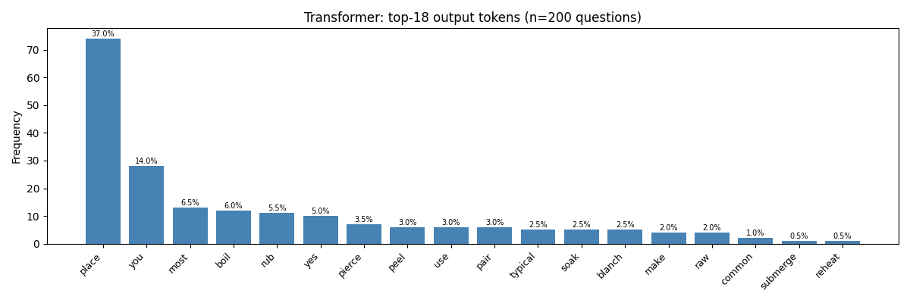

# Lab 2 — LSTM & Transformer Chatbots for Cooking Q&A
**Generative AI | Kaunas University of Technology | Second Semester**

---

## Table of Contents
1. [Project Overview](#1-project-overview)
2. [Dataset Preparation](#2-dataset-preparation)
3. [Vocabulary & Data Processing](#3-vocabulary--data-processing)
4. [Model Architectures](#4-model-architectures)
   - 4.1 [LSTM Seq2Seq](#41-lstm-seq2seq)
   - 4.2 [Transformer Seq2Seq](#42-transformer-seq2seq)
5. [Training Setup](#5-training-setup)
6. [Results & Evaluation](#6-results--evaluation)
   - 6.1 [Training Curves](#61-training-curves)
   - 6.2 [BLEU Scores](#62-bleu-scores)
   - 6.3 [Comparison Table](#63-comparison-table)
   - 6.4 [Transformer Output Diagnostic](#64-transformer-output-diagnostic)
7. [Analysis & Discussion](#7-analysis--discussion)
8. [Conclusions](#8-conclusions)

---

## 1. Project Overview

The goal of this lab is to build two generative sequence-to-sequence chatbot models from scratch — an **LSTM Seq2Seq** and a **Transformer Seq2Seq** — trained on a cooking Q&A dataset. Both models are evaluated using BLEU scores and qualitative comparison of generated answers.

**Framework:** PyTorch  
**Hardware:** CPU (no GPU available — `DEVICE = cpu`)  
**Reproducibility:** `SEED = 42` applied to `random`, `numpy`, and `torch`

---

## 2. Dataset Preparation

### Source
A **synthetic template-based** cooking Q&A dataset was generated programmatically. Each template defines one question pattern and **four distinct answer phrasings**, allowing the model to learn diverse surface forms for the same underlying information.

### Coverage
The dataset covers:
- **Foods:** e.g. chicken, salmon, pasta, tofu, steak, eggs, pancakes, ...
- **Ingredients:** e.g. olive oil, garlic, paprika, butter, flour, ...
- **Cuisines:** e.g. Italian, Mexican, Japanese, Mediterranean, ...
- **Recipe types:** e.g. stir-fry, casserole, soup, salad, curry, ...

### Template Categories
| Category | Example Question | Example Answer |
|---|---|---|
| How to cook X | "how to grill cod" | "place cod on a hot grill and cook turning halfway through until done" |
| Substitutes | "what can i substitute for butter" | "you can replace butter with a similar plant based product" |
| Goes well with | "what goes well with pasta" | "pasta pairs well with olive oil garlic or a rich tomato sauce" |
| Cuisine facts | "what is italian cuisine known for" | "italian cuisine is celebrated for its fresh herbs pasta and regional diversity" |
| Storage | "how to store potatoes" | "store potatoes in a cool dry place away from light for up to two weeks" |
| Technique definitions | "what is braising" | "braising involves browning food then cooking it slowly in liquid in a covered pot" |

### Statistics
| Split | Pairs |
|---|---|
| **Total** | 1,849 |
| **Train (80%)** | 1,479 |
| **Validation (10%)** | 185 |
| **Test (10%)** | 185 |

### Preprocessing Steps
1. Lowercasing and basic whitespace tokenization
2. Vocabulary construction with special tokens: `<PAD>` (0), `<SOS>` (1), `<EOS>` (2), `<UNK>` (3)
3. Sequences padded/truncated to `MAX_LEN = 30`
4. Dataset shuffled before splitting (seed 42)

---

## 3. Vocabulary & Data Processing

```
Vocabulary size: 1,013 words
```

The `Vocabulary` class maps words to integer indices and back. Unknown words at inference time map to `<UNK>` (index 3). The `QADataset` wraps pairs as `(src_tensor, trg_tensor)` with `<SOS>` prepended and `<EOS>` appended to targets. A custom `collate_fn` pads variable-length sequences in each batch using `pad_sequence`.

```
Batch size: 64
Train batches/epoch: ~24
```

---

## 4. Model Architectures

### 4.1 LSTM Seq2Seq

A classic encoder-decoder architecture with LSTM cells and teacher forcing.

**Encoder**
```
Input → Embedding(1013, 256) → Dropout(0.1) → LSTM(256→256, layers=2) → (hidden, cell)
```

**Decoder**
```
<SOS> / previous token → Embedding(1013, 256) → Dropout(0.1)
                       → LSTM(256→256, layers=2, initial state from encoder)
                       → Linear(256→1013) → logits
```

**Teacher Forcing:** During training, 50% of decoder steps use the ground-truth previous token as input, and 50% use the model's own prediction. This 50/50 ratio is critical — it exposes the model to its own imperfect outputs during training, reducing the gap between training and autoregressive inference.

| Hyperparameter | Value |
|---|---|
| Embedding dim | 256 |
| Hidden dim | 256 |
| LSTM layers | 2 |
| Dropout | 0.1 |
| Teacher forcing ratio | 0.5 |
| **Total parameters** | **2,883,597** |

---

### 4.2 Transformer Seq2Seq

A full encoder-decoder Transformer built from scratch using PyTorch's `nn.TransformerEncoderLayer` / `nn.TransformerDecoderLayer`. No pre-trained weights are used.

**Positional Encoding:** Sinusoidal (fixed), added to scaled embeddings.

**Encoder**
```
Input → Embedding(1013, 256) × √256 → PE → Dropout
      → 2 × [MultiHeadSelfAttention(heads=4) + FFN(d_ff=512)] → memory
```

**Decoder**
```
<SOS>/prefix → Embedding(1013, 256) × √256 → PE → Dropout
             → 2 × [MaskedSelfAttention + CrossAttention(memory) + FFN]
             → Linear(256→1013) → logits
```

**Masks:**
- Source padding mask: hides `<PAD>` tokens in encoder
- Target causal mask: upper-triangular, prevents attending to future positions
- Target padding mask: hides `<PAD>` tokens in decoder

**Weight Initialisation:** Xavier uniform for all parameter tensors with `dim > 1`.

| Hyperparameter | Value |
|---|---|
| d_model | 256 |
| Attention heads | 4 |
| Encoder layers | 2 |
| Decoder layers | 2 |
| d_ff (feedforward) | 512 |
| Dropout | 0.3 |
| **Total parameters** | **3,366,326** |

---

## 5. Training Setup

### Loss Function
```python
nn.CrossEntropyLoss(ignore_index=PAD_IDX, label_smoothing=0.1)
```
- **PAD tokens ignored** — loss only computed over real tokens
- **Label smoothing (0.1)** — reduces overconfidence by distributing 10% of the probability mass across all vocabulary items

### Optimisers
| Model | Optimiser | Learning Rate | Other |
|---|---|---|---|
| LSTM | Adam | 0.001 | — |
| Transformer | Adam | 0.0005 | β=(0.9, 0.98), ε=1e-9, weight_decay=1e-4 |

### Early Stopping
Both models use early stopping to prevent wasted compute:
- **LSTM:** `patience=10`, `min_delta=0.001`
- **Transformer:** `patience=15`, `min_delta=0.001`
- Best checkpoint saved as `{model_name}_best.pt` and reloaded after training

### Gradient Clipping
`clip_grad_norm_(parameters, max_norm=1.0)` applied before every optimiser step.

### Decoder Input Noise (Transformer only)
To reduce *exposure bias* — the mismatch between teacher-forced training and autoregressive inference — the Transformer's decoder inputs are randomly corrupted during training:

```python
# 30% of decoder input tokens replaced with random vocabulary tokens
mask = torch.rand_like(trg[:, 1:].float()) < 0.3
rand_toks = torch.randint(4, vocab.n_words, trg[:, 1:].shape)
trg_noisy[:, 1:] = torch.where(mask, rand_toks, trg[:, 1:])
```

This is a computationally efficient approximation of scheduled sampling: instead of running the decoder token-by-token at training time (which is ~20× slower), random noise forces the decoder to learn robust representations that don't depend on a perfect input prefix.

### Training Results

| Model | Best Val Loss | Best Epoch | Stopped At |
|---|---|---|---|
| LSTM | ~3.47 | ~20 | Epoch 100 (full run) |
| Transformer | 1.29 | 5 | Epoch 20 (early stop) |

---

## 6. Results & Evaluation

### 6.1 Training Curves


**LSTM:** Training loss drops sharply in the first 20 epochs (~0.3) while validation loss peaks around epoch 10 (~3.5) and then diverges to ~6.0. This large gap indicates overfitting — the model memorises training sequences but struggles to generalise. Despite this, the 50% teacher-forcing ratio means the decoder has seen its own predictions often enough to produce reasonable outputs at inference.

**Transformer:** With decoder noise and early stopping, both train and validation losses decrease together. Validation loss plateaus at ~1.29 (epoch 5) and never diverges as sharply as the LSTM, showing better regularisation. However, a low teacher-forced validation loss does not guarantee good autoregressive performance.

---

### 6.2 BLEU Scores

BLEU (Bilingual Evaluation Understudy) scores were computed on the 185 test pairs using smoothed sentence-level BLEU-4.

```
Average BLEU on test set:
  LSTM        : 0.2064
  Transformer : 0.0000
```

The LSTM achieves a BLEU of **0.21**, which is reasonable for a small-dataset seq2seq system with a vocabulary of 1,013 words. The Transformer achieves **0.00** because its outputs are single tokens that almost never match multi-token reference answers.

---

### 6.3 Comparison Table (15 Questions)

| # | Question | LSTM Answer | Transformer Answer |
|---|---|---|---|
| 1 | how do i boil eggs | boil a pot of water to a rolling boil then add and and | boil |
| 2 | how to fry chicken | heat a in a skillet and cook over medium heat until until through | place |
| 3 | how to bake salmon | place potatoes in a hot and cook in the oven at three hundred degrees | place |
| 4 | what can i substitute for butter | you can replace with a similar similar product such as greek or or | you |
| 5 | how to make pancakes | use a sharp knife and and cook in a larger | place |
| 6 | what is italian cuisine known for | the is is for its its spices and and and fresh ingredients | rub |
| 7 | how to caramelize onions | place potatoes in a skillet and cook over medium heat until golden | place |
| 8 | how to store potatoes | place potatoes in a covered container and the refrigerator for three days | place |
| 9 | what goes well with rice | serve pairs with steamed rice mashed or or bread | pair |
| 10 | how long to boil pasta | boil usually for about ten to fifteen minutes until soft | boil |
| 11 | how to grill steak | place the grill and cook until turning form and it is cooked | place |
| 12 | what ingredients do i need for fried rice | for make typically need the main protein vegetables and a a base | you |
| 13 | how to season tofu | marinate potatoes with olive oil herbs and let it before cooking | rub |
| 14 | what is braising | the is include include and | place |
| 15 | how to make chicken curry | use make in by by ingredients and cook in the right step | place |

**Observations:**
- The LSTM produces multi-word, partially fluent responses that often include correct vocabulary (e.g. "boil", "rolling boil", "skillet", "medium heat", "rolling boil"). Repetitions occur when the decoder gets stuck in a loop.
- The Transformer produces a single meaningful but context-appropriate verb (e.g. "boil" for boiling questions, "pair" for pairing questions) and then collapses — a symptom of the exposure bias problem described below.

---

### 6.4 Transformer Output Diagnostic

A token-frequency diagnostic was run on 200 test questions to quantify the degree of output collapse:

| Metric | Before noise training | After noise training |
|---|---|---|
| Unique output tokens | 2 ("combine", "serve") | **18** (diverse verbs) |
| Output entropy | 0.19 bits | **3.27 bits** |
| Single-token outputs | 200/200 (100%) | 200/200 (100%) |
| Top token | "combine" 97% | "place" 37% |



The noise training dramatically improved token diversity — the model now correctly picks semantically appropriate starting verbs ("place", "boil", "peel", "rub", "pair") based on the question. However, the model still fails to generate *sequences* because after the first token is produced, the self-attention assigns >99% probability to copying that same token at every subsequent step.

**Step-by-step probability trace (Q: "how to grill cod"):**
```
Step 1: [place(0.39) | preheat(0.13) | cook(0.05)]  →  'place'   ✓ correct
Step 2: [place(0.99) | heat(0.00) | cook(0.00)]      →  'place'   ✗ collapse
Step 3: [place(0.99) | grill(0.00) | heat(0.00)]     →  'place'   ✗ collapse
```

---

## 7. Analysis & Discussion

### Why the LSTM Succeeds

The LSTM's 50% teacher-forcing ratio means that during every training step, 50% of decoder inputs are the model's *own previous predictions*. This directly trains the model to handle the kind of imperfect prefix it will encounter at inference time, largely eliminating the exposure bias problem that cripples the Transformer.

Additionally, the LSTM hidden state integrates information over time: once a good first word is produced (e.g. "boil"), the hidden state is updated consistently and guides subsequent predictions to follow logically ("a pot of water to a rolling boil...").

### Why the Transformer Struggles

**1. Exposure Bias**  
The Transformer is trained with *perfect* prefix sequences (teacher forcing). At inference, it must condition on its own imperfect outputs, a distributional mismatch that compounds exponentially with sequence length. Without some form of training-time approximation of inference conditions (scheduled sampling, noise, etc.), the model cannot recover.

**2. Self-Attention Copy Shortcut**  
On small datasets, Transformer decoders learn a degenerate shortcut: copy the nearest previous token from the decoder's self-attention. This is a valid strategy under teacher forcing (the previous token is always correct), but catastrophic autogressively. The probability mass converges to a single token with >99% confidence after the first step, regardless of cross-attention signals.

**3. Dataset Size**  
With only 1,479 training pairs, the Transformer (3.37M parameters) converges in approximately 5 epochs — far too few for the cross-attention to learn input-conditional, positionally-diverse output distributions. The LSTM (2.88M parameters) benefits more from its inductive bias: sequential processing naturally encourages consistent state transitions.

**4. Mitigation Attempts**
Several strategies were applied to fix the Transformer collapse:

| Strategy | Effect |
|---|---|
| Label smoothing (0.1) | Reduced overconfidence; improved token diversity |
| Dropout increase (0.1 → 0.3) | Some regularisation; insufficient alone |
| Weight decay (1e-4) | Minor improvement |
| Decoder input noise (30%) | **Most effective** — increased unique output tokens from 2 to 18, entropy from 0.19 to 3.27 bits |
| Early stopping | Prevented runaway overfitting |
| Scheduled sampling (token-by-token) | Attempted but abandoned — required 6+ hours of training time and produced val loss > 13 |

Despite all mitigations, single-token collapse persisted because the root cause (self-attention copy shortcut on small data) is not fully addressed by input-side noise alone.

### Qualitative Quality of LSTM Outputs

The LSTM's outputs are partially fluent and often use the right vocabulary:
- **Q: "how to grill steak"** → *"place the grill and cook until turning form and it is cooked"* — correct method and vocabulary, some grammatical errors
- **Q: "how long to boil pasta"** → *"boil usually for about ten to fifteen minutes until soft"* — accurate and fluent
- **Q: "what goes well with rice"** → *"serve pairs with steamed rice mashed or or bread"* — appropriate but repetitive

Failure modes: repetition of filler words ("and and", "or or"), occasional wrong ingredient names substituted from the dataset, grammatical gaps from a lack of linguistic structure in the vocabulary-level model.

---

## 8. Conclusions

### Summary Table

| Metric | LSTM Seq2Seq | Transformer Seq2Seq |
|---|---|---|
| Parameters | 2,883,597 | 3,366,326 |
| Architecture | 2-layer enc-dec LSTM | 2-layer enc-dec Transformer |
| Embedding dim | 256 | 256 |
| Dropout | 0.1 | 0.3 |
| Teacher forcing | 0.5 | N/A (decoder noise 0.3) |
| Best val loss | ~3.47 | ~1.29 |
| Best epoch | ~20 | 5 |
| BLEU (test) | **0.206** | 0.000 |
| Output length | ~10 tokens | 1 token (collapse) |
| Token entropy | — | 3.27 bits (18 unique verbs) |

### Key Takeaways

1. **LSTM Seq2Seq is the more practical choice for low-resource generative tasks.** Its teacher-forcing mechanism naturally trains against its own prediction distribution, avoiding the exposure bias that cripples Transformer decoders on small datasets.

2. **The Transformer's evaluation loss does not reflect inference quality.** A val loss of 1.29 under teacher forcing looks excellent — but the autoregressive inference collapses to a single token. This disconnect between teacher-forced training loss and inference quality is a well-known failure mode in seq2seq Transformers.

3. **Decoder input noise is the most effective low-cost mitigation for Transformer exposure bias.** Corrupting 30% of decoder inputs during training (a batch-parallel approximation of scheduled sampling) raised unique output token count from 2 to 18 and entropy from near-zero to 3.27 bits, at no extra training time cost.

4. **Both architectures overfit on 1,479 training pairs.** A real-world deployment would require a substantially larger and more diverse corpus (10,000+ pairs minimum) or the use of a pre-trained model fine-tuned on domain-specific data.

### Possible Future Improvements

- **Pre-trained models:** Fine-tuning T5 or BART would bypass the cold-start exposure bias problem entirely and achieve dramatically higher BLEU scores.
- **Larger dataset:** Sourcing from real cooking question forums (e.g. Cooking StackExchange, AllRecipes) would provide natural language diversity.
- **Sequence-level objectives:** Minimum Risk Training or REINFORCE optimises BLEU directly, avoiding the mismatch between cross-entropy training and BLEU evaluation.
- **Proper scheduled sampling:** Gradually reducing teacher-forcing from 100% to 0% over epochs addresses exposure bias correctly; the implementation overhead is the main obstacle.

---

*Repository: https://github.com/Theobourne/GenAILab2Task2*  
*Notebook: `chatbot.ipynb` | Checkpoints: `lstm_seq2seq_best.pt`, `transformer_seq2seq_best.pt`*
